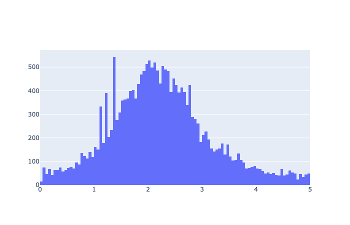
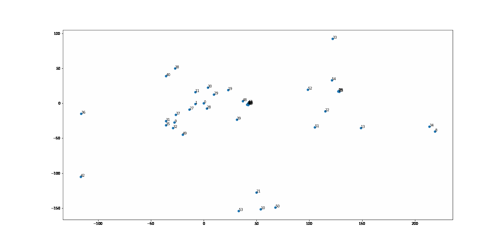

# FloorMagic's Helvar Solution

We are Kim, Martin, Paula and Troels, team FloorMagic in Junction 2021. This is our solution to Helvar's Challenges 1 and 2.

## Challenge 1:

The first challenge is to find the position of sensors on a floorplan. We have the image of the floorplan, the list of sensors and events registered by those sensors. To evaluate our solution, we also have access to the real position of sensors on the floorplan.

Our approach is to first find the relative distance between sensors. To do this, we listen for events that happen close in time, and find sensors with multiple events close in time.

When we plot the events connecting two sensors, we can distinguish if they are close or not, using the distribution of time between events. This is an example of two sensors located around 2.5 seconds apart from each other. (We use time as distance here, since we don't have a real distance measurement.)

Now that we have the relative distance, we can start plotting it and generate a network. Our initial approach used multiple ways to represent the network, and we tried multiple ways of filtering nodes and edges to get the best result.

One example of a network can be accessed here: https://healthymindtech.com/j2021-helvar-C1/network

At this stage our data is in the form of a distance matrix, with missing values, and we need to find the missing values and plot the sensors on a 2D plane. We learnt that this is an existing problem in the IOT world and multiple solutions have been proposed, for example: http://islab.snu.ac.kr/upload/iotlocalizationlowrankmatrixcompletion.pdf

We developed our own solution, FloorMagic's Iterative Jittery Rabbits Algorithm (FloMaIJiRA). The algorithm places sensors randomly on a 2D plane and checks the existing distances between sensors in the input distance matrix. When those distances are not close enough, the algorithm moves the sensors around and checks again.

We ended up with a reasonably close solution for the first challenge, as the algorithm converged into a shape similar to the floor plan. The algorithm had no information about the real position of any sensors, or the floor plan.

Our algorithm should be able to provide better results when given the real position of a subset of sensors.

## Challenge 2:

We have used our analysis of the data provided by Helvar to find the most common patterns of movement between sensors across different times of the day. 

For each hour of the day, we have identified which pairs of sensors register the largest flow and show it in the following animation. We coded this animation using Phaser 3, a JavaScript simple game developing tool.

The animation can be accessed here: https://healthymindtech.com/j2021-helvar-C1/

This information can be of use to identify common paths between areas in the building, and to identify the best locations for sensors in future projects.

## Challenge 3:

The third problem was identifying what is going on in the garage space where audio and motion sensors are installed. 

Based on the audio data we can sort of identify the difference between different sounds via the spectrogram. This was through manual inspection but we think given more training data, we’d be able to classify the sounds automatically.

We have performed audio dissection and spectrograms using librosa for tracking movements of objects in a very noisy garage. (Though we didn't integrate this into a final delivery as it was purely exploratory)

To map out the audio, we did not have time to find proper deep learning models for identifying the differently sounding objects. 

Furthermore after some research, we became fairly convinced that one algorithm will probably not cover the tracking of every kind of moving object, rather different types of sounds (e.g. rhythmic versus continuous) will require different approaches for proper tracking and determination of the distance. 

Link to repo: https://github.com/HealthyMindTech/junction-2021-floormagic

